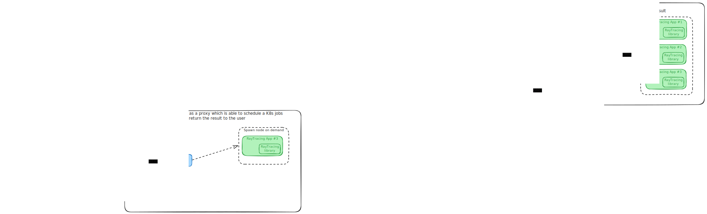

# DistributedRaytracer

The objective of this project is to create a distributed raytracer service capable of rendering animations. The service will achieve this by splitting the frames of the animation into smaller tasks and distributing them to multiple workers. These workers will render the frames and send them back to the service, which will then combine them to create the final animation.

## Design



## Example


## Usage

To generate a new render and save it to `output.png` file on local machine, start application and perform a POST request:

```bash
docker compose up -d
curl -X POST http://localhost:8090/render -d '{"width": 800, "height": 400, "raysperpixel": 10, "seed": 2024}' --output output.png
```

## Reference

- [Ray Tracing in One Weekend](https://raytracing.github.io/books/RayTracingInOneWeekend.html)
